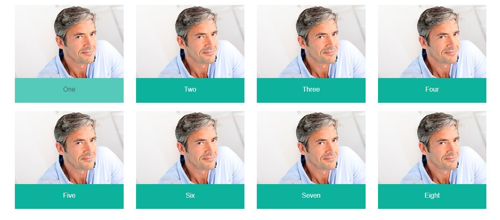
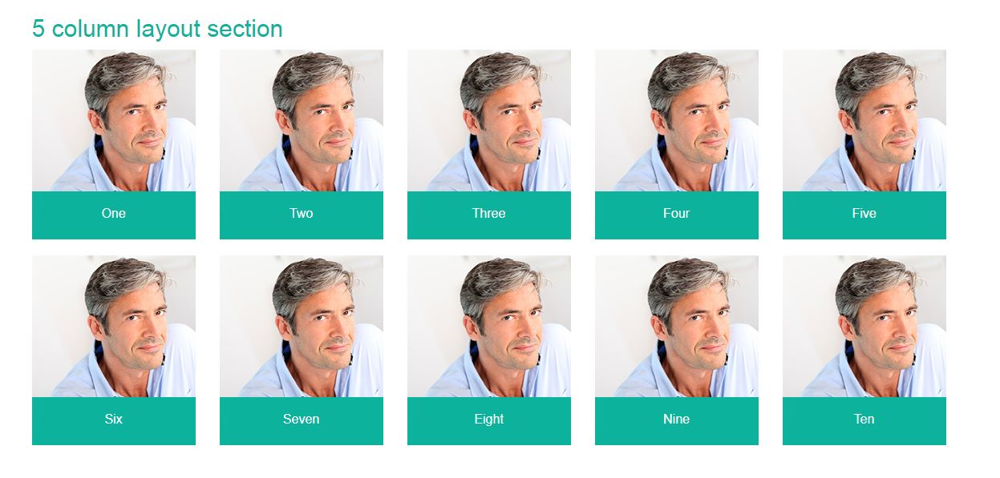
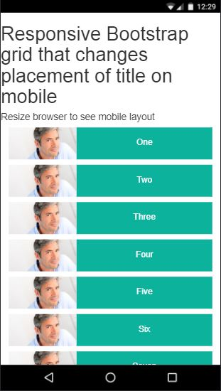

# Responsive Bootstrap Grid

# Features:
* Subheadings move to side on mobile view
* Subheadings have swipe animation on hover
* Images have zoom in animation on hover
* Custom Bootstrap with 5 column grid

# Install:
* $ cd lib
* npm install
* $ grunt (to compile SCSS)

# 4 column Desktop layout view:
  

# 5 column Desktop layout view:
  

# Mobile layout view:
  

# gif:
  
